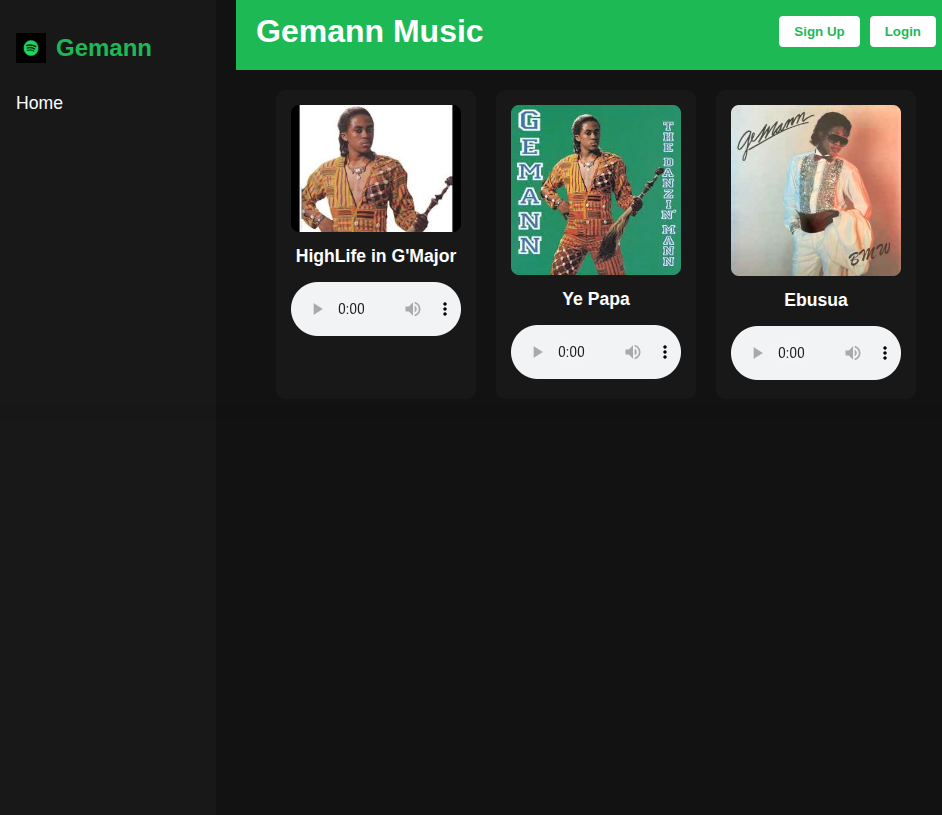

# 🎶 Geeman Music 🎶  
_A minimalistic music player inspired by good old Ghanaian highlife and an afro-fueled misunderstanding._

## Backstory

So picture this:  
It's a regular Tuesday morning at **Solv Ghana** (Standard Chartered Ghana), and I stroll into the office, afro in full bloom, ready to debug life itself. My CTO takes one look at me and says:

> “Ei George… with this afro you dey look like Gemann oh!” 😅

**Gemann**—yes, that Gemann. The legendary Ghanaian highlife musician with grooves smoother than butter on banku.  
Next thing I know, the tech team is listening to *"Ebusua"*, *"Ye Papa"*, and other vintage fire over coffee and JSON payloads.

### And thus, *Geeman Music* was born...

As a joke (and subtle flex for my internship's e-learning proof presentation), I decided to build a music player app. But not just *any* music player—one powered by the **socio-technical systems (STS) framework** because... why not overcomplicate a simple idea?

## 🎧 What It Does

- Plays classic highlife bangers (okay, just a few... for now 🎵)
- Lets you browse and search through uploaded tracks
- Protected routes (because security matters even in jams)
- Minimalistic UI that says "I code, but I vibe too"

## 🚀 Future Plans

Because our office WiFi blocks music streaming (who hurt you, IT team? 😭), I plan to:
- Turn this into a **peer-to-peer music sharing** platform
- Let us stream "some freaking music" without needing Spotify
- Maybe even let you upload your own tunes and start a virtual *choir*

## 💻 Tech Stack

- Java 17  
- Spring Boot  
- JWT Auth  
- HTML5 + CSS3 + JS  
- Thymeleaf (for now, but React might sneak in soon)  
- Postman-tested, CTO-approved™  

## 🤖 Run Locally

```bash
git clone https://github.com/malimba/GeeManMusic.git
cd geeman-music
mvn spring-boot:run
Then open your browser at http://localhost:8080 and feel the groove.
```
 ---
🧪 Known Issues
Might get nostalgic listening to the sample tracks

Still very MVP—no playlists, no shuffle, no skip Gemann's dance breaks

WiFi might still block your vibes, so P2P is on the roadmap 🔥

🕺 Final Thoughts
This started as a joke... but like most good things, now it’s personal.
Feel free to tinker, clone, remix, or make your own version.
Just don’t forget to let your afro out and stream responsibly. 🙃

Made with ❤️, STS stress, and funky beats by
George Malimba Billa-Yandanbon
Intern at Solv Ghana-Standard Chartered / Certified Afro Advocate


---
### Screenshots




